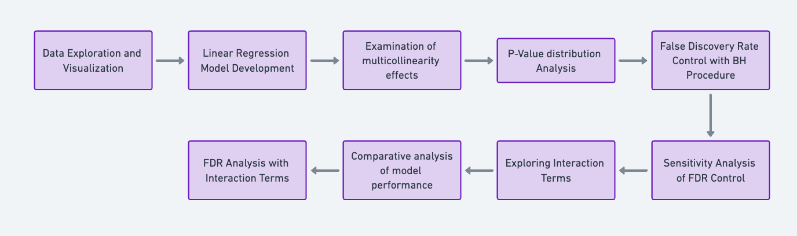
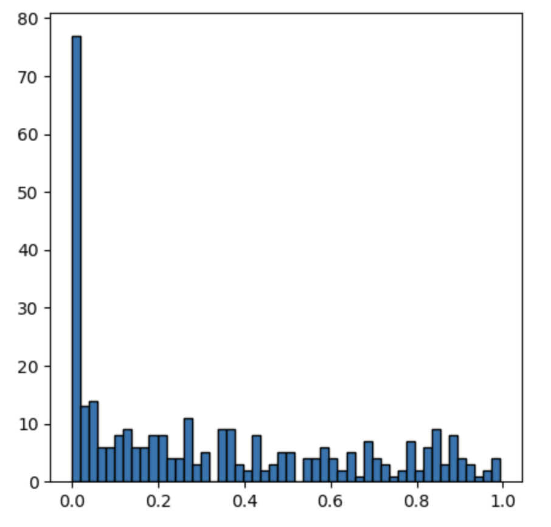
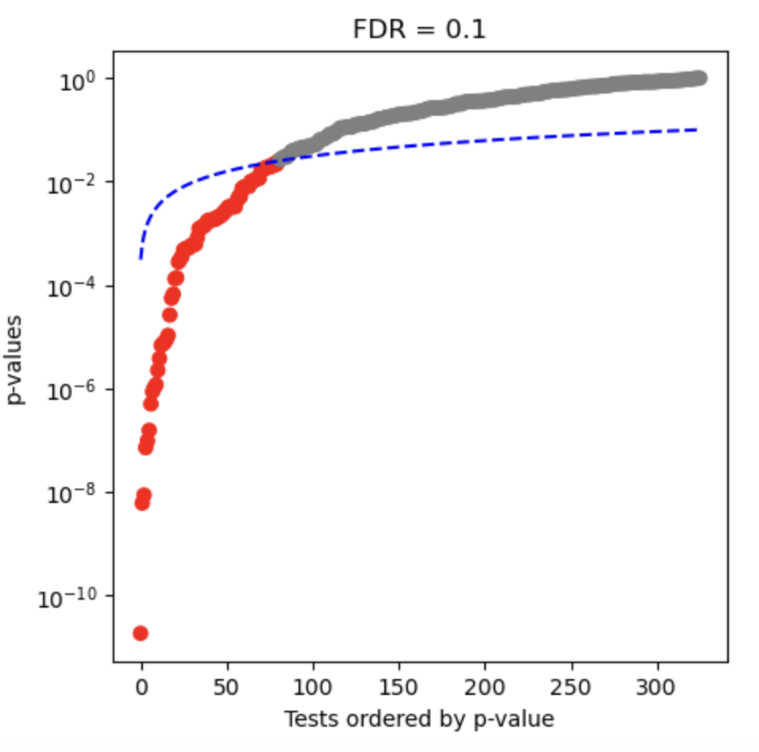

# Linear-Regression-and-FDR
## Fundamental and Statistical Analysis of Stock Data

### Overview
This project explores the feasibility and effectiveness of automated trading by analyzing fundamental and technical aspects of stock data. Utilizing data from SEC 10K filings from 2012-2016, we delve into the intricacies of stock market data, aiming to derive most of popular fundamental indicators. 

The project is structured around a series of analytical tasks, including data exploration, linear regression modeling, multicollinearity analysis, p-value analysis, and False Discovery Rate (FDR) control, culminating in the evaluation of a linear regression model enhanced with interaction terms.

### Dataset Description
The dataset comprises metrics extracted from annual SEC 10K filings over the period 2012-2016. It contains 1781 observations and 78 attributes, providing a rich foundation for deriving popular fundamental indicators and performing comprehensive stock analysis.

### Project Structure
The project is divided into several key sections:

- Data Exploration and Visualization: Initial exploration of the fundamentals.csv dataset, including visualization of key metrics and trends.

- Linear Regression Model Development: Development of a linear regression model to predict Estimated Shares Outstanding, detailing the model's formulation and interpretation.

- Multicollinearity in Linear Regression: Examination of how multicollinearity affects the interpretation of a linear regression model's coefficients.

- P-Value Analysis and Histogram: Analysis of the distribution of p-values from the regression model, focusing on skewness and its implications.

- False Discovery Rate Control with BH Procedure: Application of the Benjamini-Hochberg procedure to control the FDR, identifying the number of significant predictors.

- Sensitivity Analysis of FDR Control: Exploration of the impact of varying q-values in the BH procedure on the identification of significant predictors.

- Exploring Interaction Terms: Enhancement of the linear regression model with interaction terms to capture complex relationships between predictors.

- Model Evaluation with Interaction Terms: Comparative analysis of model performance with and without interaction terms, using appropriate evaluation metrics.

- FDR Analysis with Interaction Terms: Re-evaluation of the FDR control incorporating interaction terms, comparing the number of significant predictors identified against the original model.

## Outcomes

Skewness towards the 0 value mark shows that there are true discoveries.

- We discovered 81 significant predictors out of which 10% can be false, which means about 73 predictors are actually true discoveries.

- This also is alligned with the observation that the interaction models p-value histogram plot - more extreme skewness.

- In the original model we recognised 11 significant predictors out of which 10 were true predictors based on the FDR rate
- In the interaction model we recognised 81 significant predictors out of which 73 were true predictors based on the FDR rate
- Including interaction terms really boosts our models capability to discover more true significant predictors compared to the normal model.
